# MENAREPS Pharmaceutical CRM — User Manual

---

## Welcome

MENAREPS is a comprehensive pharmaceutical field operations management system designed to streamline the daily workflow of pharmaceutical sales teams. This manual covers all features available across every user role.

**Supported Roles:**
- Superadmin / Admin
- General Manager
- Regional Manager
- Country Manager
- Area Sales Manager (ASM)
- Medical Representative (Med Rep)
- Sales Representative (Sales Rep)
- Supervisor
- Finance
- Warehouse / Inventory
- Marketing

---

# SECTION 1 — Getting Started

## 1.1 Logging In

1. Open your browser and navigate to the MENAREPS app URL.
2. You will see the login screen with two fields: **Username** and **Password**.
3. Enter your credentials provided by your administrator.
4. Click **Sign In**.
5. You will be redirected to your dashboard based on your assigned role.

> **Note:** If you forget your password, contact your system administrator to reset it. There is no self-service password reset.

## 1.2 Understanding Your Role

Each user sees a different set of features in the sidebar based on their role. The system automatically displays only the pages relevant to you.

| Role | Primary Focus |
|---|---|
| Admin / Superadmin | Full system access — all features |
| General Manager | National-level oversight, all analytics, all approvals |
| Regional Manager | Team oversight, territory, analytics, approvals |
| Country Manager | Country-level team management and analytics |
| ASM | District team management, visit planning |
| Medical Rep | Physician visits, medical planner, samples |
| Sales Rep | Pharmacy visits, orders, stock requests |
| Supervisor | Visit oversight, coaching, leave approvals |
| Finance | Payments, receipts, financial reports |
| Warehouse | Inventory, batch management, warehouse ops |

## 1.3 Navigation

The **sidebar** on the left side of the screen is your main navigation tool. It is organized into groups:

- **Dashboard** — Your home screen with KPI summary cards
- **Field Operations** — Physicians, pharmacies, visits, planning
- **Sales & Orders** — Offers, orders, stock requests
- **Samples** — Sample allocation, requests, analytics
- **Territory & Team** — Your territory map, team members, org chart
- **Analytics** — Reports, performance dashboards, AI reports
- **Finance** — Financials, receipts, payments
- **Productivity** — Notifications, tasks, workday, meetings
- **Account** — Settings, User Manual (this guide), Logout

Click any group heading to expand it. Click a link to navigate to that page.

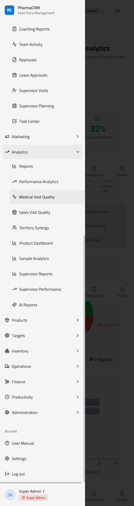

---

# SECTION 2 — Dashboard

## 2.1 Overview

The Dashboard is the first screen you see after logging in. It shows a summary of the most important metrics for your role.

## 2.2 KPI Cards

Each colored card at the top of the dashboard represents a key performance indicator (KPI). The cards display:

- **Current value** — The number or percentage for the current period
- **Target** — Your assigned goal
- **Trend** — Whether you are above or below the previous period

**Clicking a KPI card** takes you directly to the relevant section. For example:
- Clicking **Total Revenue** takes you to Financials
- Clicking **Physician Coverage** takes you to the Physicians page
- Clicking **Active Reps** takes you to the Team page
- Clicking **Total Orders** takes you to the Orders page

## 2.3 Role-Specific Dashboards

### Manager / Admin Dashboard
Shows: Total Revenue, Sales Target, Achievement %, Total Orders, Completion Rate, Active Reps, Physician Coverage, Pharmacy Coverage, Outstanding Balance, and more.

### Medical Rep Dashboard
Shows: My Visits Today, Monthly Visits, Physician Coverage, Completion Rate, and visit quality scores.

### Sales Rep Dashboard
Shows: Orders Placed, Revenue Generated, Pharmacy Coverage, Outstanding Payments, Stock Request Status.

### Supervisor Dashboard
Shows: Team Visits Today, Team Completion Rate, Pending Approvals, Physician and Pharmacy coverage for the supervised team.

---

# SECTION 3 — Field Operations

## 3.1 Physicians

The **Physicians** page is the central database of all medical professionals assigned to your territory.

### Viewing Physicians
- The page shows a table of all physicians with their specialty, location, class (A/B/C/D), and last visit date.
- Use the **filters** panel to narrow results by specialty, class, territory, or status.
- Use the **status dropdown** to toggle between Active, Inactive, or All physicians.

### Adding a Physician
1. Click the **"Add Physician"** button (top right).
2. Fill in the required fields: Name, Specialty, Location, Phone, Class.
3. Click **Save**.

### Physician Profile
Click on any physician's name to open their full profile which shows:
- Contact information
- Visit history
- Sample history
- Assigned products
- GPS verification status

## 3.2 Pharmacies

The **Pharmacies** page manages all pharmacy accounts in your territory.

### Viewing Pharmacies
- Displays pharmacy name, location, type (retail/hospital/chain), class, and last order date.
- Filter by territory, class, status, or type.

### Adding a Pharmacy
1. Click **"Add Pharmacy"**.
2. Fill in Name, Location, Owner/Contact, Type, and Class.
3. Click **Save**.

### Pharmacy Profile
Clicking a pharmacy name opens the profile showing:
- Order history
- Outstanding balance
- Visit history
- Assigned sales rep

## 3.3 GPS Verified Customers

This page shows all physicians and pharmacies that have been verified via GPS location check-in during visits. A green checkmark indicates GPS-confirmed location.

## 3.4 Check-In / Check-Out (Daily Work Session)

The system enforces a **Golden Rule**: one check-in and one check-out per working day. This tracks your actual working hours and ensures accountability.

### How It Works
- At the **start of your day**, tap **Check In** from the dashboard or the sidebar prompt.
- The system records your check-in time with your GPS location.
- At the **end of your day**, tap **Check Out**.
- You cannot log field visits unless you have checked in for the day.

### Important Notes
- Only **one check-in** is allowed per calendar day.
- If you forget to check out, the system will **auto-checkout** at the configured end-of-day time.
- Your administrator can enable or disable the check-in requirement per user.
- All time tracking uses the correct local timezone.

## 3.5 Visits

The **Visits** page is the central log of all field visits made by the team.

### Viewing Visits
- See all visits with date, rep name, customer visited, visit type, duration, and status.
- Filter by date range, rep, territory, or visit type.

### Advanced Filters
For managers and supervisors, an advanced filter panel is available:
- **Date Range** — Filter visits by start and end date.
- **Medical Supervisor / Medical Rep** — Cascading dropdowns: selecting a supervisor automatically narrows the rep list to their direct team.
- **Sales Supervisor / Sales Rep** — Same cascading behavior for pharmacy visits.

> The advanced filter panel appears only when you select **Physicians** or **Pharmacies** as the visit type — it is hidden when viewing all visit types together.

### Creating a Medical Visit (Medical Visit Hub)

1. Navigate to **Field Operations → Physician Visits (Medical Visit Hub)**.
2. Click **"New Visit"**.
3. Select the physician from your assigned list.
4. The system will prompt GPS check-in — confirm your location.

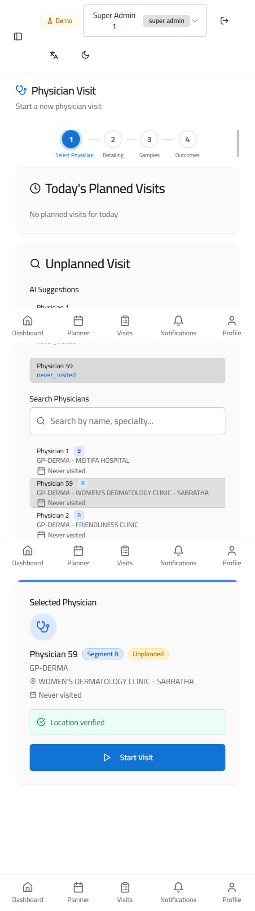

5. The visit form opens with multiple tabs. Fill in the **Product Detailing** tab: select products discussed, scientific content shared, and physician response.

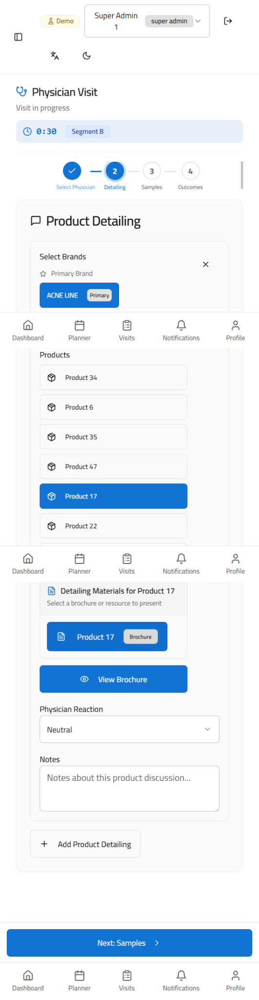

6. Switch to the **Samples** tab to record any samples distributed during the visit.

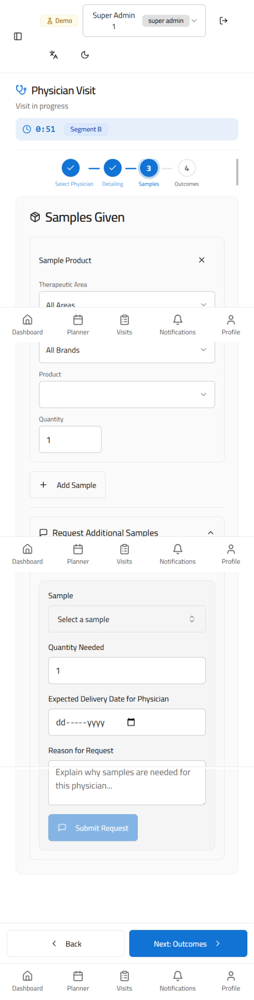

7. Complete the **Outcomes** tab with overall visit notes and next steps.

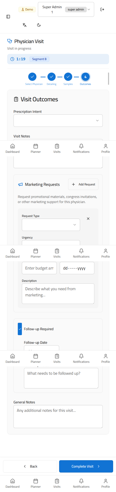

8. Click **Submit** to save the visit.

### Creating a Sales Visit (Pharmacy Visit Hub)

1. Navigate to **Field Operations → Pharmacy Visits**.
2. Click **"New Visit"**.
3. Select the pharmacy.

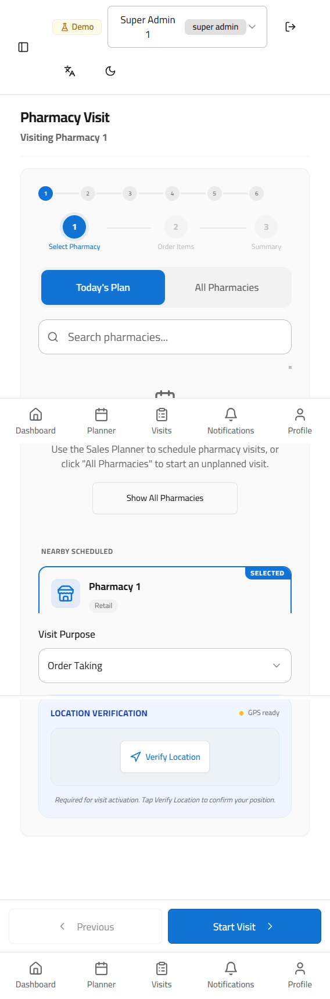

4. The visit form has **4 tabs**:
   - **Order Items** — Add products and quantities for the order placed during this visit.

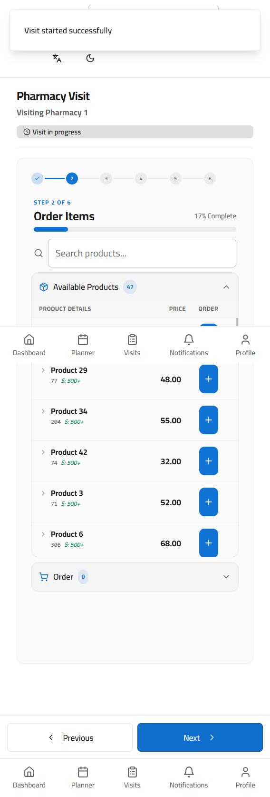

   - **Apply Offers** — View and apply any active promotional offers to the order.

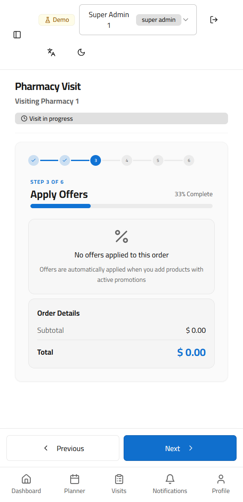

   - **Payment** — Record payment collected, payment method, and outstanding balance.

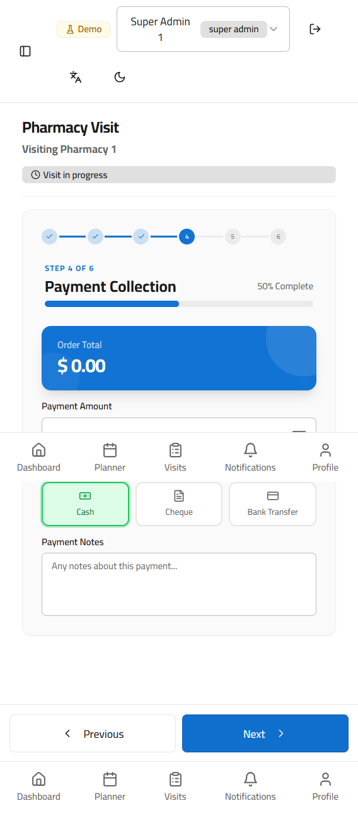

   - **Outcomes / Intel / Intent** — Record CRM notes, competitive intelligence, and the pharmacy's purchase intent level. Select one of four intent options:
     - **Will Order** — Ready to place an order now
     - **Considering** — Interested but not yet committed
     - **Needs Info** — Requires more information before deciding
     - **Not Interested** — Not a current purchase opportunity

5. Click **Complete Visit**.

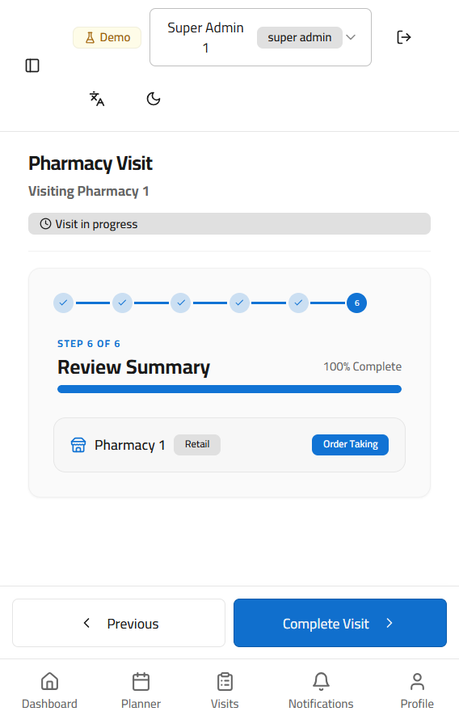

## 3.6 Medical Planner

The **Medical Planner** is the scheduling tool for medical representatives to plan their physician visits in advance.

### Creating a Plan
1. Navigate to **Field Operations → Medical Planner**.
2. Select the week or month you want to plan.
3. Drag physicians from the left panel onto the calendar days.
4. Set the time and expected duration for each visit.
5. Click **Save Plan**.

> **Tip:** Your supervisor will review and may approve or request changes to your plan before you execute it.

### Smart Auto-Planner
Instead of building a plan manually, you can use the **Auto-Planner**:
1. Click **"Auto-Plan"** in the Medical Planner.
2. Set your preferences: number of visits per day, priority rules (e.g. prioritize Class A physicians or those not visited recently).
3. The system generates an optimized visit plan based on your rules and territory.
4. Review the suggested plan and adjust if needed.
5. Click **Save Plan**.

### Auto-Cancellation & Replanning
If a planned visit is not completed by end of week, the system automatically:
- Marks the visit as **Cancelled (Auto)**.
- Adds it to a **Priority Replan** list for the following week.
- Notifies your manager of any escalated missed visits.
Cancelled and replanned visits are highlighted in the planner for easy identification.

## 3.7 Sales Planner

Similar to the Medical Planner but for sales representatives managing pharmacy visits and order-taking schedules. The Smart Auto-Planner and auto-cancellation rules apply here as well.

---

# SECTION 4 — Sales & Orders

## 4.1 Orders

The **Orders** page manages all sales orders placed with pharmacies.

### Viewing Orders
- Table shows order number, pharmacy, rep, products, value, date, and status.
- Status can be: Pending, Confirmed, Shipped, Delivered, Cancelled.
- Filter by status, date range, rep, or territory.

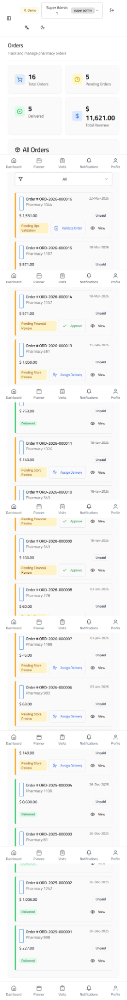

### Placing a New Order
1. Click **"New Order"**.
2. Select the pharmacy.
3. Add products and quantities.
4. Review the total value.
5. Click **Submit Order**.

### AI Order Scanning (Image-to-Order)
Instead of typing products manually, you can scan a handwritten or printed price list:
1. In the New Order screen, click **"Scan Image"**.
2. Take a photo or upload an image of the price list or WhatsApp order sheet.
3. The AI automatically reads product codes, names, and quantities from the image.
4. A **draft order** is shown with confidence indicators:
   - **Green** — High confidence match
   - **Amber** — Review recommended
   - **Red** — No matching product found
5. Edit quantities or remove items as needed.
6. Confirm — the order enters the standard approval workflow.

> **Note:** AI Order Scanning is also available directly inside the Pharmacy Visit form during a sales visit.

### Order Detail
Click any order number to see the full order detail including:
- Products and quantities
- Pricing
- Delivery status and timeline
- Payment status

## 4.2 Offers

The **Offers** page shows all active promotional offers available for pharmacies. Reps can view current promotions and apply them when placing orders. The system automatically calculates bonus quantities or discounts based on offer rules.

## 4.3 Stock Requests

Sales reps use this page to request additional stock from the warehouse when their assigned inventory runs low.

### Creating a Stock Request
1. Navigate to **Sales & Orders → Stock Requests**.
2. Click **"New Request"**.
3. Select the product and quantity needed.
4. Add a justification note.
5. Submit — this goes to the warehouse for fulfillment.

---

# SECTION 5 — Samples

## 5.1 Sample Allocation

Administrators and managers use this page to allocate sample quantities to medical representatives. The system tracks a **three-tier inventory flow**:
1. **Warehouse Stock** → allocated to rep
2. **Rep Stock** → distributed to physicians during visits
3. **Physician Receipt** — recorded and linked to each visit

Each sample batch is tracked with its **batch number** and **expiry date**. Alerts are generated for batches approaching expiry.

## 5.2 Sample Requests

Medical representatives use this page to request additional samples beyond their initial allocation.

### Submitting a Sample Request
1. Navigate to **Samples → Sample Requests**.
2. Click **"New Request"**.
3. Select the product and quantity.
4. Add justification.
5. Submit — this goes to the supervisor for approval.

## 5.3 Sample Approvals

Supervisors and managers see all pending sample requests here and can approve or reject them.

## 5.4 Physician Sample Requests

This page shows samples that have been distributed to specific physicians during visits.

## 5.5 Sample Analytics

Provides a visual dashboard showing sample consumption patterns, distribution trends, and ROI by product and territory. Includes alerts for low stock and expiring batches.

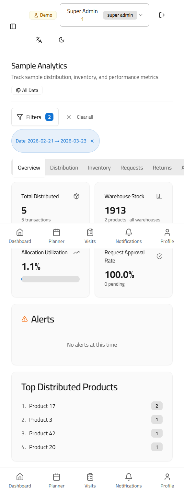

Switch to the **Inventory** tab to view current stock levels, reserved quantities, and a product-by-product inventory chart with low-stock alerts.

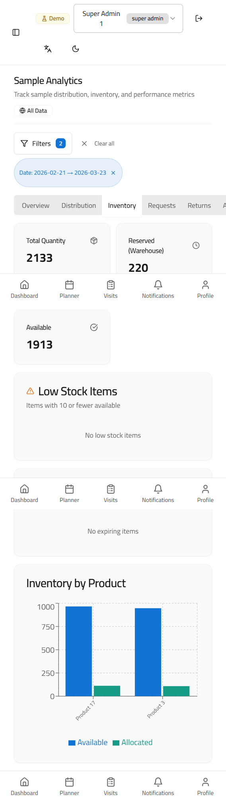

---

# SECTION 6 — Territory & Team

## 6.1 My Territory

Shows your assigned geographic territory on a map with:
- Physician locations (pins)
- Pharmacy locations (pins)
- Coverage statistics
- Visited vs. not-visited customers

Use this to plan efficient routing for your daily visits.

## 6.2 Team

The **Team** page shows all members of your team with their role, territory assignment, and current activity status.

### Team Member Profile
Click a team member to see:
- Their assigned territory
- Visit performance this month
- Order performance
- Coaching notes

## 6.3 Organization

Shows the full organizational hierarchy as a tree chart — from national level down to individual reps.

## 6.4 Territory Management

Administrators and managers use this page to define, split, and assign territories to team members.

## 6.5 Target Setting

Managers use the **Target Setting Hub** to assign performance targets to their team.

### Setting Targets
1. Navigate to **Territory & Team → Target Setting**.
2. Select the team member and time period (monthly / quarterly / annual).
3. Set targets at the **product level** or overall revenue level.
4. Annual targets are distributed across quarters automatically, or you can set each quarter manually.
5. Submit for approval — targets go through an approval workflow before becoming active.

### Importing Targets from Excel
- Download the target template from the page.
- Fill in the rep names, products, and target values.
- Upload — the system validates and imports all targets in bulk.

> **Tip:** Reps can see their own targets on their dashboard and the **Rep Performance Report**.

---

# SECTION 7 — Supervision

## 7.1 Coaching Reports

Supervisors use this page to document coaching sessions with field reps. Coaching notes are attached to the rep's profile and used in performance reviews.

## 7.2 Team Activity

Real-time feed of what your team is doing — visits checked in, orders placed, samples given. Useful for supervisors monitoring daily execution.

## 7.3 Approvals

Central hub for all pending approvals:
- Visit plan approvals
- Sample request approvals
- Marketing activity approvals
- Order approvals (for high-value orders)

Click any approval item to review details and approve or reject with a comment.

## 7.4 Leave Approvals

Manage team leave requests. View pending requests, approve or reject them, and see the team calendar to check coverage.

## 7.5 Supervisor Visits

Log visits where a supervisor accompanies a field rep. These double-visits are tracked separately for coaching purposes.

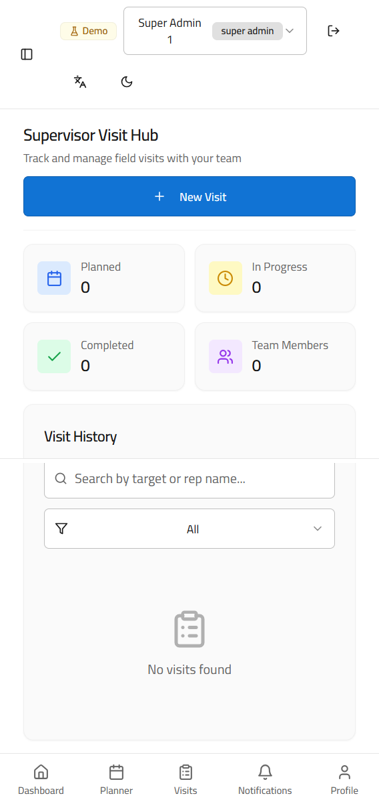

Click **"New Supervisor Visit"** to log a coaching visit. Select the rep accompanied, the customer visited, and the coaching evaluation scores.

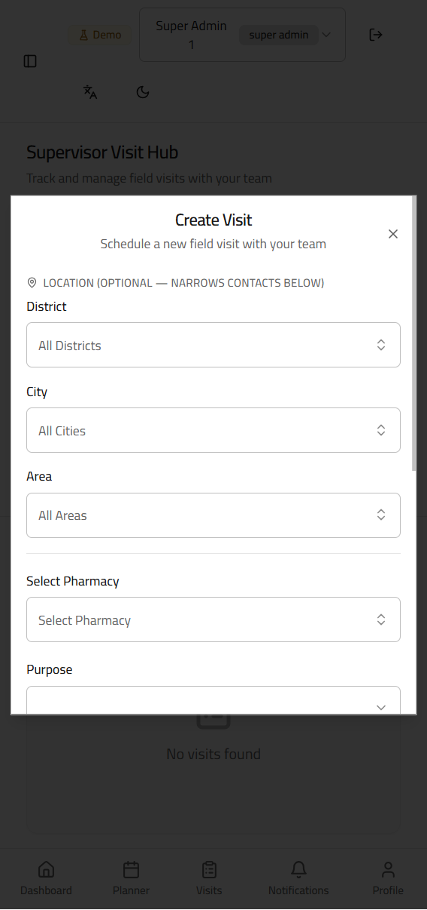

### Supervisor Reports
The **Supervisor Reports** page tracks overall field team performance under each supervisor, covering both Medical and Sales teams. Key metrics include:

- **Plan Execution Rate** — % of planned visits actually completed
- **Accompanied Visits** — Number of coaching visits logged
- **Area Coverage** — % of assigned territories visited
- **Task Completion** — % of assigned tasks done

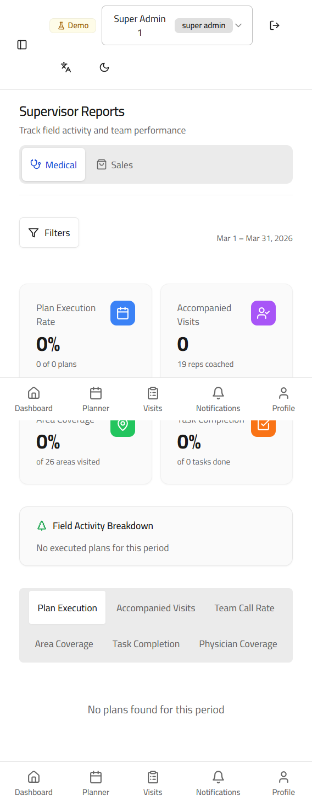

## 7.6 Task Center

Create, assign, and track tasks for your team members. Each task has a deadline, priority, and completion status.

---

# SECTION 8 — Analytics & Reports

## 8.1 Reports

The **Reports Hub** is the main data export and summary page showing:
- Total visit counts, physician visits, and pharmacy visits
- Order and payment summaries
- Visit completion rate
- Resource view counts
- Visit status breakdown (Completed / Scheduled / Cancelled)
- One-click export buttons: **Export Visits**, **Export Orders**, **Export Payments**

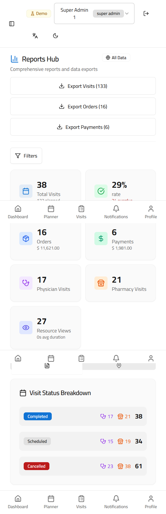

## 8.2 Performance Analytics

Comprehensive performance dashboard showing:
- Individual rep performance vs. target
- Territory performance comparison
- Month-over-month trends
- Visit quality scores
- Revenue contribution by product

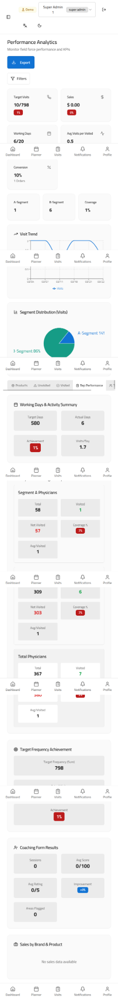

### Rep Performance Report
Click on any individual rep to open their **Rep Performance Report** — a detailed breakdown across 5 KPI sections:
1. Visit frequency and coverage rate
2. Order volume and revenue contribution
3. Sample utilization
4. Physician/pharmacy relationship quality
5. Achievement vs. target (monthly and quarterly)

## 8.3 Medical Visit Quality

Analyzes the quality of physician visits based on:
- Visit frequency
- Products discussed
- Scientific content shared
- Physician feedback (positive / neutral / negative reaction)

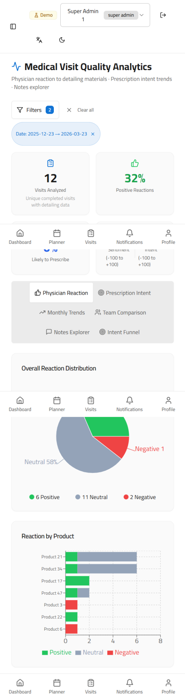

The monthly trends chart shows visit quality scores over time, making it easy to spot improvement or decline.

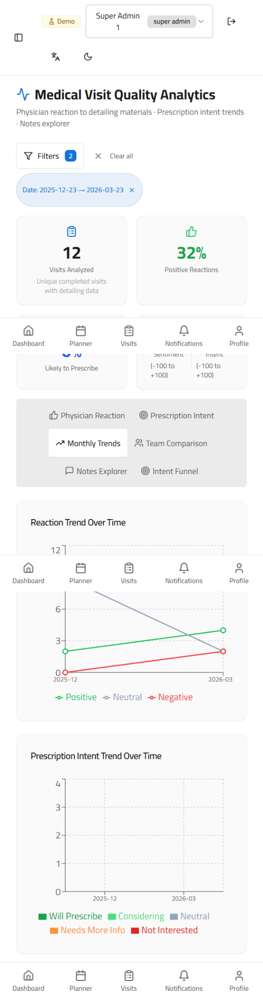

### Intent Funnel Tab
Switch to the **Intent Funnel** tab to see a breakdown of physician **prescription intent** across your territory:
- A horizontal bar chart shows how many physicians fall into each intent level: *Very Likely → Likely → Neutral → Unlikely → Very Unlikely*
- Click any bar to filter the physician table below to that group
- The table shows each physician's name, specialty, assigned rep, area, intent level, and last visit reaction

## 8.4 Sales Visit Quality

Similar to Medical Visit Quality but focused on pharmacy visits — order size, visit regularity, relationship quality, stock levels, and promotional delivery rate.

Also includes:
- **Competitive Intelligence summary** — shelf space comparisons and competitor brand presence across pharmacies
- **Rep Leaderboard** — ranked by visit quality scores

### Account Funnel Tab
Switch to the **Account Funnel** tab to see a breakdown of pharmacy **purchase intent** across your territory:
- A horizontal bar chart shows how many pharmacy accounts fall into each intent level: *Will Order → Considering → Needs Info → Not Interested*
- Click any bar to filter the account table below to that group
- The table shows each pharmacy's name, assigned rep, area, last visit date, intent badge, and current stock level

## 8.5 Territory Synergy

Shows how well different reps in adjacent territories are collaborating and avoiding overlap. Includes brand and product filters to drill into specific product lines.

## 8.6 Product Dashboard

Sales and distribution analytics broken down by product line. Includes a **Territory Pharmacy Sales** table showing pharmacy-level purchase data, filterable by district, city, area, territory, and rep. Field reps see only their own territory; managers see their full hierarchy.

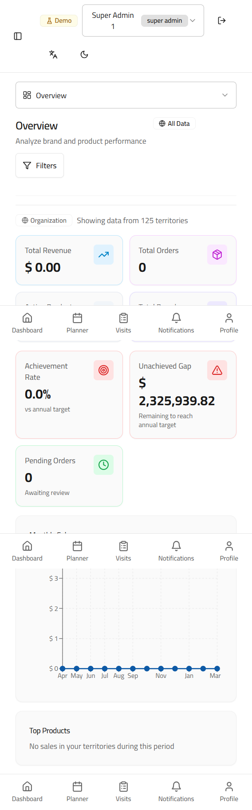

Switch to the **Brand Performance** tab to compare brands side by side with revenue, volume, and target achievement metrics.

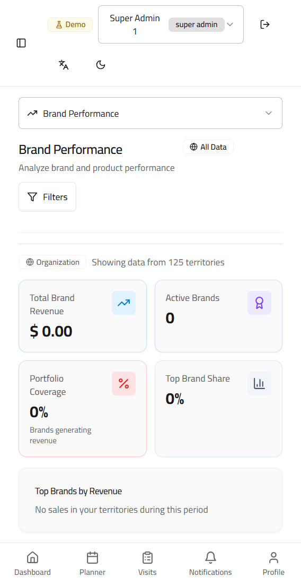

## 8.7 AI Reports

The **AI Reports Hub** generates intelligent insights and recommendations based on your data. The hub shows your reports used and budget consumed at the top.

Browse the full list of available AI report types — covering sales performance, territory analysis, team leaderboards, physician visit quality, sample analytics, coaching summaries, and more.

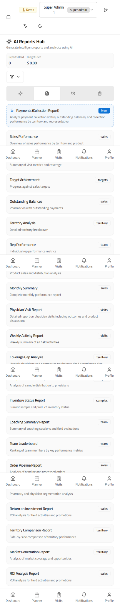

To generate a structured report, select a report type, configure the team type, supervisor, and date range, then click **Generate AI Report**.

To ask a free-form question about your data, use the **Ask a Question** tab:

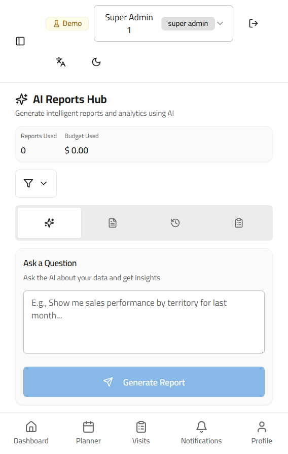

### Exporting AI Reports
After generating a report:
- Click **"Export to Word"** to download a formatted Word document with embedded charts (bar, line, pie).
- Click **"Export to PDF"** to download a PDF version with charts on a dedicated visualizations page.

> **Note:** The PDF export is available for English reports. Arabic reports are exported as Word documents to preserve right-to-left formatting.

---

# SECTION 9 — Resource Center

The **Resource Center** is a centralized library of product materials, clinical documents, promotional PDFs, and training files.

## 9.1 Browsing the Resource Center
- Documents are organized by product and category.
- Use the search bar or filters to find materials by product name, document type, or date.
- Click any document to open it in the viewer.

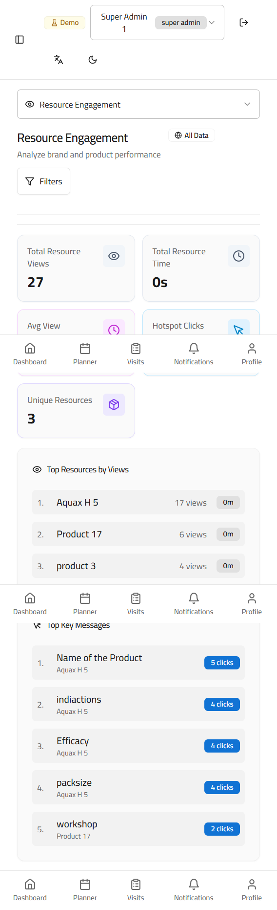

## 9.2 Role-Based Access
Not all documents are visible to all roles. Your administrator controls which materials each role can access.

## 9.3 Usage Tracking
The system tracks which documents you have opened and when (hotspot tracking). Managers can see which materials their team is actively using to identify which resources are most effective.

---

# SECTION 10 — Finance

## 10.1 Financials

The main financial overview showing:
- Total revenue this period
- Outstanding balances by pharmacy
- Payment collection progress

## 10.2 Receipt Books

Digital receipt books for recording payments collected in the field. Each receipt is numbered, dated, and linked to a pharmacy account. The system tracks serial number sequences and flags any gaps or skipped receipts.

### Creating a Receipt
1. Navigate to **Finance → Receipt Books**.
2. Select or create a receipt book.
3. Click **"New Receipt"**.
4. Enter pharmacy name, amount collected, payment method, and date.
5. Save — the receipt is logged and the pharmacy balance is updated.

## 10.3 Receipt Tracking

View the status of all issued receipts — paid, pending, or disputed. Voided receipts are flagged and tracked through a separate workflow.

## 10.4 Finance Dashboard

Executive financial overview with charts showing:
- Revenue by region
- Collection rate
- Outstanding by aging bucket (30/60/90 days)

## 10.5 Payment Processing

Process incoming payments and reconcile them against outstanding invoices.

## 10.6 Financial Reports

Detailed financial reports available for download. Filter by period, region, or product.

## 10.7 Budget Management

Managers can set and track departmental budgets for marketing activities, samples, and operational expenses.

---

# SECTION 11 — Productivity

## 11.1 Notifications

The **Notifications** page shows all system alerts and messages sent to you. Types include:
- Approval decisions (approved/rejected)
- Task assignments
- Plan approval requests
- System announcements

Unread notifications show a red badge count on the sidebar. Click each notification to mark it as read.

## 11.2 My Tasks

Your personal task list showing all tasks assigned to you by your manager or supervisor. Each task shows:
- Task title and description
- Due date
- Priority (High / Medium / Low)
- Status (Pending / In Progress / Completed)

Click a task to update its status or add a completion note.

## 11.3 My Coaching

View coaching sessions that your supervisor has logged for you. Use these notes to track your development areas and progress.

## 11.4 My Brands

Shows the product portfolio you are responsible for promoting in the field, with product details and key selling points.

## 11.5 My Workday

Daily planner showing your scheduled visits for today, your route, and any tasks due today.

## 11.6 Meetings

Schedule, manage, and log meetings with physicians, pharmacists, or internal team members. The Meeting Hub shows upcoming and past meetings with notes.

---

# SECTION 12 — Administration

> This section is only visible to Admin and Superadmin users.

## 12.1 User Management

Create and manage all user accounts in the system.

### Creating a New User
1. Navigate to **Administration → User Management**.
2. Click **"Add User"**.
3. Fill in: Full Name, Username, Password, Role, Territory, Manager.
4. Click **Save**.
5. Share the username and password with the new user — they should change their password on first login via Settings.

### Editing a User
Click the edit icon next to any user to change their role, territory assignment, or status (Active/Inactive).

### Deactivating a User
Set a user's status to **Inactive** to prevent login without deleting their data.

## 12.2 Role Sidebar Settings

Customize which sidebar sections are visible for each role. Use this to simplify the navigation for specific roles that don't need certain sections.

## 12.3 Data Import

Bulk-import data from Excel files. Supported imports:
- Physicians list
- Pharmacies list
- Territory assignments
- Products
- Rep targets

Download the template, fill it in, and upload. The system validates the data before saving.

## 12.4 Location Management

Define the geographic hierarchy used in the system:
- Country → Region → Area → Territory → District

## 12.5 Location Settings

Configure GPS boundaries and check-in radius for each territory.

## 12.6 Regional Settings

Set region-specific preferences including currency, working days, and reporting periods. Administrators configure the allowed check-in window (e.g. reps cannot check in before 12:10 AM) and auto-checkout time (e.g. 11:00 PM). Currency symbol, decimal places, numeral format, and public holidays are also managed here.

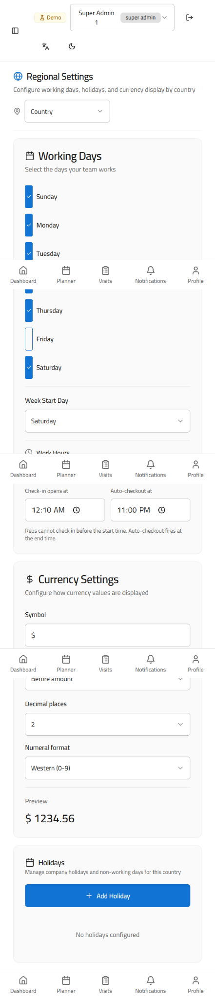

## 12.7 Order Workflow Settings

Configure the approval workflow for orders — which order values require manager approval, which can be auto-confirmed.

---

# SECTION 13 — Settings

## Personal Settings

Navigate to **Account → Settings** to update:
- Your display name
- Your password
- Language preference (English / Arabic)
- Notification preferences (email and push)

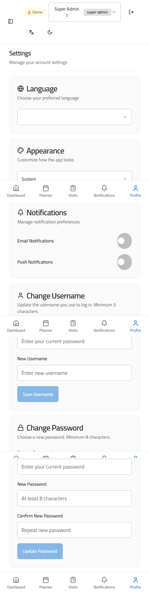

---

# SECTION 14 — Accessing This Manual

This manual is always available from the sidebar. Look for **"User Manual"** under the **Account** section at the bottom of the sidebar. Clicking it opens this guide in a new browser tab.

---

*MENAREPS — Empowering Pharmaceutical Field Teams*
